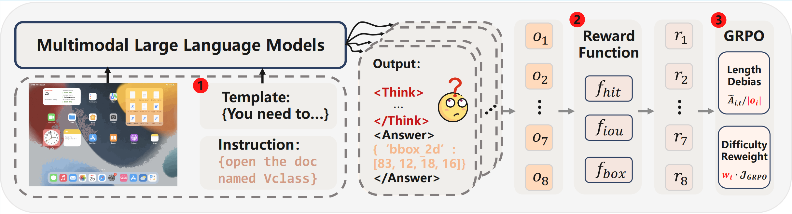

# GUI-G1

The model and dataset are currently under review and will be released soon. Thank you for your patience.

## News
- **[2025/5/22]** Our [**paper**] is released.

# GUI-G1: Understanding R1-Zero-Like Training for Visual Grounding in GUI Agents

<div style="width: 100%; margin: 0;">
  
</div>

> This repository is based on [VLM-R1](https://github.com/omlab/VLM-R1), with several improvements and adaptations for our use case, especially on **Template**, **Reward Functions**, and **GRPO Objective**.

<font size=4><div align='center'> \[[🤗 Data(Ing...)](https://github.com/Yuqi-Zhou/GUI-G1)] \[[🤗 Checkpoint(Ing...)](https://github.com/Yuqi-Zhou/GUI-G1)] </div></font>


In this work, we build upon the original [VLM-R1](https://github.com/omlab/VLM-R1) frameworks. We introduce **GUI-G1**, a VLM fine-tuned for **GUI Grounding**.

---

## 🔧 Major Modifications

* Introduced a **Fast Thinking Template** that requires no model reasoning, accelerating training and inference
* Utilized diverse **reward functions (Hit, IoU, Box)** to prevent reward hacking and achieve multi-objective optimization
* Removed **length correction** from the GRPO objective and added a **difficulty coefficient** to enhance model robustness
---

## Setup

```bash
conda create -n myproject python=3.10
conda activate myproject
bash setup.sh
```

---

Follow the steps below to prepare data and train the model:

> 1. \[Data preparation instructions customized for your setup]
> 2. \[Reference to your configuration files or modified scripts]
> 3. Use the following command to launch training:

```bash
bash src/open-r1-multimodal/run_scripts/run.sh
```

---

## Results

| Model         | ScreenSpot | ScreenSPot-Pro |
| ------------- | --------------- | ------------------- |
| InfiGUI-R1-3B  |   87.5      |    35.7           |
| **GUI-G1-3B** |    **90.3**    | **37.1**            |

---

## Acknowledgements

This repository builds upon the great work from:

* [VLM-R1](https://github.com/omlab/VLM-R1)

We thank the authors for their open-source contributions.

---

## Citation
If you find this project useful, welcome to cite us.
```bib
@article{zhou2025guig1,
  title        = {GUI-G1: Understanding R1-Zero-Like Training for Visual Grounding in GUI Agents},
  author       = {Zhou, Yuqi and Dai, Sunhao and Wang, Shuai and Zhou, Kaiwen and Jia, Qinglin and Xu, Jun},
  howpublished = {\url{https://github.com/Yuqi-Zhou/GUI-R1}},
  year         = {2025}
}
```

